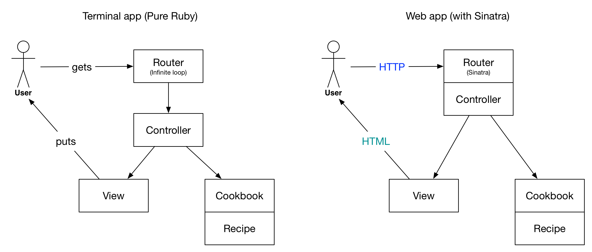

# Sinatra 101

This repository is a tutorial for a first contact with the [Sinatra](http://www.sinatrarb.com/) gem, a [DSL](https://en.wikipedia.org/wiki/Domain-specific_language) for quickly creating web applications in Ruby with minimal effort.

## Architecture

We coded a simple MVC architecture where the user communicated his/her intent thanks to the **router infinite loop**, `gets`-ing a number and converting it into a `Controller` method call. In the end, the view give the information back to the user thanks to the simple `puts`.

A web app is really close to this behavior, with two minor differences. First, we use a framework (like Sinatra) to handle the router part. Here, the user expresses his/her intent with an **HTTP request**. It's up to the framework to route this HTTP request to the correct action in the `Controller`. In the end, the view is responsible to build **HTML** which is sent back to the user.



## Setup

Create a new folder to put your sinatra app in. For instance:

(replace `$GITHUB_USERNAME` with your own name!!)

```bash
mkdir ~/code/$GITHUB_USERNAME/cookbook-sinatra
cd ~/code/$GITHUB_USERNAME/cookbook-sinatra
git init  # That's a brand new repo!
```

In this directory, we create a [`Gemfile`](http://bundler.io/gemfile.html) to specify which gems we'd like to use in this project.

```bash
touch Gemfile
```

Open this `Gemfile` in Sublime Text (`stt`) and copy-paste this code:

```ruby
source "https://rubygems.org"

gem "sinatra"
gem "sinatra-contrib"
gem "pry-byebug"
gem "better_errors"
gem "binding_of_caller"
```

In the terminal, run the following command to fetch the gems specified in the `Gemfile`:

```bash
bundle install
```

In you `git status`, you should see 2 files: `Gemfile` and `Gemfile.lock`. The `Gemfile` is where you put your project dependencies (_i.e._ which gem you want to `require` in your project), and the `Gemfile.lock` is an **auto-generated** file which specifies versions for each gem. It **locks** them actually.

Time for some checkpoint, we can commit our work:

```bash
git status
# There should be 2 files here
git add .
git commit -m "Init sinatra project"
```

Now we'll also proudly push our code to GitHub :)

```bash
hub create                 # came from `brew install hub` or `gem install hub` on Linux
git push origin master
```

You can open this project in GitHub with `hub browse`.

OK we're ready to write some code!

## Sinatra app

Create a file at the directory root which will be the Sinatra app main file, the entry point, the one we want to run:

```bash
touch app.rb
```

In this file, you can copy/paste with this boilerplate:

```ruby
require "sinatra"
require "sinatra/reloader" if development?
require "pry-byebug"
require "better_errors"
configure :development do
  use BetterErrors::Middleware
  BetterErrors.application_root = File.expand_path('..', __FILE__)
end

get '/' do
  'Hello world!'
end
```

That's it. It says that for an HTTP request at the root (`/`), it will return `Hello world!`. Open a new tab in your terminal and run this:

```bash
bundle exec ruby app.rb
```

You should get this output:

```bash
# == Sinatra (v1.4.7) has taken the stage on 4567 for development with backup from Puma
# Puma starting in single mode...
# * Version 3.3.0 (ruby 2.3.0-p0), codename: Jovial Platypus
# * Min threads: 0, max threads: 16
# * Environment: development
# * Listening on tcp://localhost:4567
# Use Ctrl-C to stop
```

You can see that this command **does not return**. It's running forever, like a `while` loop. And it says that's is running a web server on port `4567`. That means that you can **open your browser** and go to [localhost:4567](http://localhost:4567) and see `Hello world`.

Great you made your first web server and your first HTTP request to it!

If you change the `Hello world` string with something else, save the file, go back to the browser, hit refresh, you should see your change appear. Handy!

Let me break it to you, the `app.rb` will act as the **Router** and the **Controller** of your MVC app. The routing part is the `get '/'` and the controller part is the blocks passed to the `get` (and other HTTP verbs as we'll see...) method.

```ruby
get '/' do  # <- Router part

  # [...]   #
  # [...]   # <- Controller part
  # [...]   #

end
```

Time for a commit:

```bash
git status          # What changed?
git add app.rb
git commit -m "Boilerplate sinatra app"
git push origin master
```

## Views

Technically, instead of `Hello world`, you'd want to return some **HTML**. Try returning `<h1>Hello <em>world</em>!</h1>` for instance. See?

Writing HTML directly inside the `app.rb` file is not really the way to go. That'll be for **other stuff** (controller stuff). We want to create dedicated file for the View part of our MVC app, a file where we can play nicely with HTML. Inside the root directory of the project, run the commands:

```bash
mkdir views
touch views/index.erb
```

Then go back in Sublime Text in the `app.rb` file and change the root block:

```ruby
# [...]

get '/' do
  erb :index
end
```

Open the `views/index.erb` file in Sublime Text and paste some HTML code, for instance

```html
<p>
  I'm in a <em>view</em>!
</p>
```

OK, go back to your browser and hit refresh. Awesome :tada:, right?

## Routing

Our app is currently very small, with just one route. What if we'd want to add an `/about` page to our website to brag about our new web development skills?

Open the `app.rb` file in Sublime Text, and add a new route, at the bottom of the file:

```ruby
# [...]

get '/about' do
  erb :about
end
```

You get the gist. Create a new view:

```bash
touch views/about.erb
```

And in this view you can put some more HTML:

```html
<h1>The team</h1>

<ul>
  <li>My buddy</li>
  <li>Me</li>
</ul>
```

Go back to the browser and go to [`localhost:4567/about`](http://localhost:4567). Awesome right?

### Other verbs

You can create routes for `POST` requests (the one the browser does when you fill in a `<form />` and hit the submit button). Works the same, see [the routing part of the doc](http://www.sinatrarb.com/intro.html#Routes)

### Parameters

If you read on the [Routes](http://www.sinatrarb.com/intro.html#Routes) section of the documentation, we'll see that it talks about the magic `params`. Until now in this tutorial we only dealt with static routes. What if you want a generic URL for all the people in your team? Say you want this:

```bash
/team/me
/team/my_buddy
# etc.
```

Do not write a route for every case! That's not how we code :) Instead, you see the emergence of a **parameter**. So we'll right this route:

```ruby
# [...]

get '/team/:username' do
  puts params[:username]
  "The username is #{params[:username]}"
end
```

Save your `app.rb` file and go to [`localhost:4567/team/ssaunier`](http://localhost:4567/team/ssaunier) and [`localhost:4567/team/Papillard`](http://localhost:4567/team/Papillard). See how you can pass parameters from the URL to the controller in `app.rb`?

Do not hesitate to put a `binding.pry` at the beginning of each controller block to **inspect in the terminal** what you have in `params`. **Very useful** 👇

```ruby
get '/team/:username' do
  binding.pry  # <= code will stop here for HTTP request localhost:4567/team/someone
  # [...]
end
```

Oh and I forgot, `params` can be filled from 3 places:

1. Routing parameters (like `/team/:username`)
1. Query string parameters (if the URL is like `/search?keyword=lewagon`)
1. Body from HTTP POST queries (coming from `<form action="post" />`)

## Passing stuff to the view

In the MVC pattern, we've seen that the controller will ask some info to the Model (with the help of a Repository handling CSV), and then ask the view to display that info. Here the controller code is inside `app.rb` and the view gets called when writing `erb :view_name`.

First of all, notice that the view file extension is `.erb`. It means **Embedded RuBy**. So you don't have to limit yourself to plain HTML in here, you can also write Ruby code and output it! For instance, try in the `views/index.erb` file:

```erb
<%= Time.now %>
```

Reload the page several time. See?

Be careful, you can use `<% %>` or `<%= %>`. The former won't output the result of your Ruby code inside the HTML. Useful for `.each` blocks:

```erb
<ul>
  <% [ 'Papillard', 'ssaunier' ].each do |username| %>
    <li>
      <%= username %>
    </li>
  <% end %>
</ul>
```

See? We just dynamically generated an HTML `<ul />` element!

OK great, but again, we're just handling static data. In the pure Ruby MVC apps (Cookbook and Food Delivery), the controller **passed some arguments to the view**. How can we do that here? Well, very simple, we'll define **instance variables** in the Controller, and they'll be automatically passed to the view :)

```ruby
# app.rb

# [...]
get '/' do
  @usernames = [ 'ssaunier', 'Papillard' ]
  erb :index
end
```

```erb
<!-- views/index.erb -->

<% @usernames.each do |username| %>
  <li>
    <%= username %>
  </li>
<% end %>
```

You see, simple: `@usernames` instance variable in the controller and you can use them in the view. Awesome :tada:!

## Layout

You can put all your views **inside** a layout, meaning they will all share some code (a navbar, a footer, etc.). Here's how you do it with Sinatra.

```bash
mkdir public
touch public/application.css
touch public/application.js
touch views/layout.erb
```

Open the `views/layout.erb` file in Sublime Text and copy/paste this boilerplate layout which uses [Bootstrap]() and [jQuery]():

```html
<!DOCTYPE html>
<html>
  <head>
    <meta charset="utf-8">
    <meta http-equiv="X-UA-Compatible" content="IE=edge">
    <meta name="viewport" content="width=device-width, initial-scale=1">

    <title>Cookbook Sinatra</title>

    <link rel="stylesheet" href="https://maxcdn.bootstrapcdn.com/bootstrap/3.2.0/css/bootstrap.min.css">
    <link rel="stylesheet" href="https://maxcdn.bootstrapcdn.com/font-awesome/4.1.0/css/font-awesome.min.css">
    <link rel="stylesheet" href="/application.css">
  </head>
  <body>

    <div class="container">
      <div class="row">
        <div class="col-sm-8 col-sm-offset-2">
          <%= yield %>
        </div>
      </div>
    </div>


    <script src="https://ajax.googleapis.com/ajax/libs/jquery/1.11.1/jquery.min.js"></script>
    <script src="https://maxcdn.bootstrapcdn.com/bootstrap/3.2.0/js/bootstrap.min.js"></script>
    <script src="/application.js"></script>
  </body>
</html>
```

You can notice in this boilerplate the `<%= yield %>` line. It's where your specific view will be inserted.

You can add some CSS in the `public/application.css` file and some JavaScript in the `public/application.js` one.

## Share with the world

Proud of your app? You'd like other people to see it? Well, they can't access your `localhost`. So we'll have to do some more configuration.

First, kill your server with `Ctrl` + `C`. Open your `app.rb` and **after** all the `require`, add this line:

```ruby
set :bind, '0.0.0.0'
```

In the terminal, restart the server with `ruby app.rb`. Now the server will be able to listen to external incoming requests. To get your local IP address, you can run the following command:

```bash
ifconfig -a | perl -nle'/(\d+\.\d+\.\d+\.\d+)/ && print '
```

You should see your IP address (something like `192.168.x.x` or `10.0.x.x`). Then other people on the **local network** will be able to access your app with `http://your_ip_address:4567`.

If you want to share your app with people outside the local network (someone at home for instance), we'll use [ngrok](https://ngrok.com/).

On OSX, you can get it with:

```bash
brew cask install ngrok
```

(On Ubuntu, you'll have to download it manually, [follow the tutorial](https://ngrok.com/download))

Then open a new terminal and run:

```bash
ngrok http 4567
```

Like for `ruby app.rb`, it will run in a loop. You'll see something like this:

```bash
# [...]
# Web Interface                 http://127.0.0.1:4040
# Forwarding                    http://600c15a0.ngrok.io -> localhost:4567
```

Open your web browser and go to the `x.ngrok.io:4567` URL given by the interface. Great, you can see your app! And so can anybody on the Internet, just share this URL with your friend, on Slack, anywhere :tada: !
